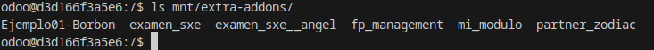
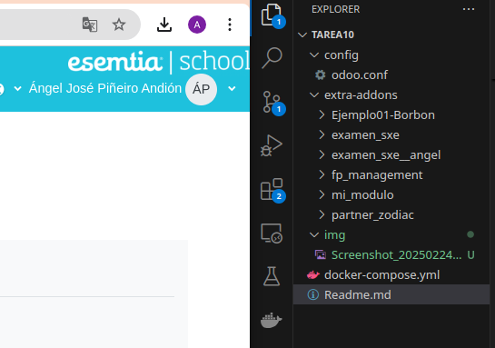
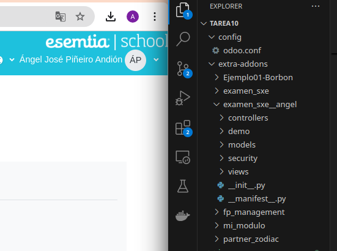
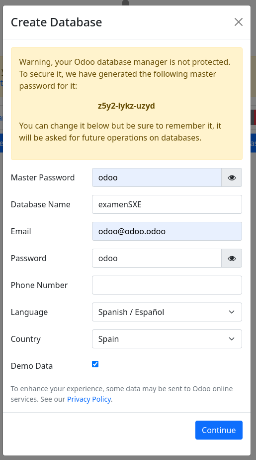
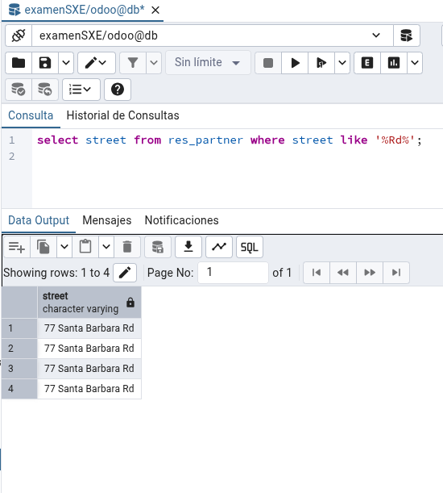
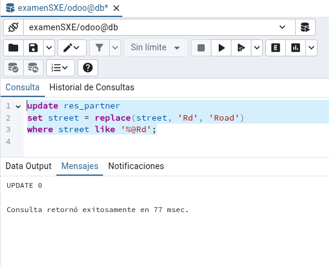
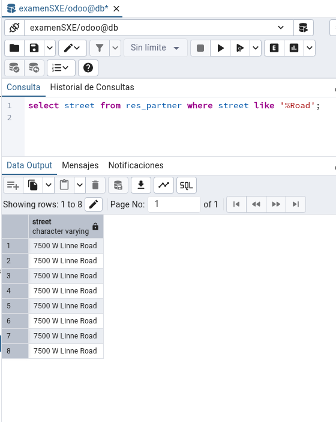

# Examen SXE

## 1.  Crea un módulo nuevo que se llame examenSXE.

Creo el modulo entrando en el contenedor de docker con:

    docker exec -it tarea10-odoo-1 bin/bash

Y utilizo scaffold para crear la estructura:

Le llamo examen_sxe__angel porque ya teniamos un modulo examen_sxe del simulacro de examen.

    odoo scaffold examen_sxe__angel mnt/extra-addons/

Tambien le damos los permisos para poder acceder desde fuera del contenedor para mayor comodidad a la hora de desarrollar el modulo:

    chmod 777 -R mnt/extra-addons/examen_sxe__angel/

De esta manera vemos que se nos ha creado el modulo correctamente:

A Continuacion creamos una base de datos nueva con info de demo en la cual vamos a instalar el modulo contactos y facturacion tal y como nos pide el enunciado.

Ahora vamos a rellenar el archivo __manifest__.py cn la informacion del modulo.

## 2. Crear el model

Creamos el model con los siguientes campos:

Nombre: Tipo carácter. Obligatorio

    ● Apellidos: Tipo carácter. Obligatorio

    ● Proyecto: Tipo texto.

    ● Tutor. Desplegable con 5 opciones:

        ○ Diego Alonso

        ○ Manuel Guimarey

        ○ Manuel Araujo

        ○ Damian Nogueiras

        ○ Sin tutor

Opción por defecto “Sin tutor”

    ● HorasDia. Tipo entero.

    ● HorasMes. Entero. Calculado. Para calcular debe se asume que es el

valor de horasDia x 30.

    # -*- coding: utf-8 -*-

    from odoo import models, fields, api

    class examen_sxe__angel(models.Model):
        _name = 'examen_sxe__angel.examen_sxe__angel'
        _description = 'examen_sxe__angel.examen_sxe__angel'

        name = fields.Char(string="Nombre", required=True)
        apellidos = fields.Char(string="Apellidos", required=True)
        proyecto = fields.Text(string="Proyecto")
        tutor = fields.Selection(
            [
                ("diego_alonso", "Diego Alonso"),
                ("manuel_guimarei", "Manuel Guimarei"),
                ("manuel_araujo", "Manuel Araujo"),
                ("damian_nogueiras", "Damian Nogueiras"),
                ("sin_tutor", "Sin tutor"),
            ],
            string="Tutor",
            default="sin_tutor",
        )
        horas_dia = fields.Integer(string="Horas al día")
        horas_mes = fields.Integer(string="Horas al mes", compute="_calcular_horas_mes", readonly=True)

        @api.depends(horas_dia)
        def _calcular_horas_mes(self):
            for record in self:
                record.horas_mes = record.horas_dia * 30

## 3. Crear las vistas

A continuación vamos a instalar las vistas de lista y formulario. Como es uan vista nueva no la vamos a extender de ningun otro modulo.

Tenemos que añadir los siguentes fragmentos al codigo:

    <record model="ir.ui.view" id="examen_sxe__angel.list">
      <field name="name">examenSXE_Angel list</field>
      <field name="model">examen_sxe__angel.examen_sxe__angel</field>
      <field name="arch" type="xml">
        <tree>
          <field name="name" string="Nombre"/>
          <field name="apellidos" string="Apellidos"/>
          <field name="proyecto" string="Proyecto"/>
          <field name="tutor" string="Tutor"/>
          <field name="horas_dia" string="Horas al día"/>
          <field name="horas_mes" string="Horas al mes"/>
        </tree>
      </field>
    </record>

    <record model="ir.ui.view" id="examen_sxe__angel.form">
        <field name="name">examenSXE_Angel form</field>
        <field name="model">examen_sxe__angel.examen_sxe__angel</field>
        <field name="arch" type="xml">
            <form string="Estudiantes y Proyectos">
                <sheet>
                    <group>
                        <field name="name" string="Nombre"/>
                        <field name="apellidos" string="Apellidos"/>
                        <field name="proyecto" string="Proyecto"/>
                        <field name="tutor" string="Tutor"/>
                        <field name="horas_dia" string="Horas al día"/>
                        <field name="horas_mes" string="Horas al mes"/>
                    </group>
                </sheet>
            </form>
        </field>
    </record>

## 4. Añadir registros en modo demo.

Para añadir registros de prueba solo cuando se inicia la base de datos en modo prueba debemos añadirlos al archivo demo/demo.xml y especificarlo en el __manifest__.py lo cual ya viene hecho por defecto porque no he cambiado el nombre al archivo demo.

    <odoo>
        <data>

          <record id="examen_sxe__angel_demo1" model="examen_sxe__angel.examen_sxe__angel">
            <field name="name">Miguel</field>
            <field name="apellidos">Mancuerna Fija</field>
            <field name="proyecto">Proyecto apasionante sobre mancuernas</field>
            <field name="tutor">diego_alonso</field>
            <field name="horas_dia">6</field>
          </record>

          <record id="examen_sxe__angel_demo2" model="examen_sxe__angel.examen_sxe__angel">
            <field name="name">Fulgencio</field>
            <field name="apellidos">Pérez Gómez</field>
            <field name="proyecto">Una aproximación a la realidad de Skynet</field>
            <field name="tutor">damian_nogeiras</field>
            <field name="horas_dia">5</field>
          </record>

          <record id="examen_sxe__angel_demo3" model="examen_sxe__angel.examen_sxe__angel">
            <field name="name">Herminia</field>
            <field name="apellidos">García Martínez</field>
            <field name="proyecto">Estudio longitudinal sobre las consecuencias
            de abusar de ChatGPT</field>
            <field name="tutor">manuel_araujo</field>
            <field name="horas_dia">7</field>
          </record>

          <record id="examen_sxe__angel_demo4" model="examen_sxe__angel.examen_sxe__angel">
            <field name="name">Lucrecia</field>
            <field name="apellidos">Sánchez Fernández</field>
            <field name="proyecto">Proyecto sobre proyectos dentro de
            proyectos</field>
            <field name="tutor">sin_tutor</field>
            <field name="horas_dia">4</field>
          </record>

        </data>
    </odoo>

## 5. Cambiar Rd en los contactos por Road utilizadno pgAdmin.

Primero consulto cuales son los regristros de la siguiente manera:

    select street from res_partner where street like '%Rd%';

A continuacion hacemos el update de la siguiente manera:

    update res_partner
    set street = replace(street, 'Rd', 'Road')
    where street like '%@Rd';

Y finalmente comporbamos si se hizo el cambio.

## 6. Si estoy extendiendo la vista kanban del módulo contactos, ¿el código a continuación mostraría el campo “signo_zodiacal”? Justica la respuesta e indica el ajuste en caso de que sea necesario.

El codigo que se muestra en la imagen pertenece al ejercicio que hicimos en clase "partner_zodiac" en el cual se nos pedia que realizaramos un modulo que calculara el signo del zodiaco a traves de la fecha de nacimiento, y mostrarlo extendiendo la vista de contactos. Es decir res_partner.

El codigo que se muestra es correcto, ya que primero hereda de las vista correspondiente, res_partner, y le añade el campo correspondiente al kanban. En este caso el signo_zodiacal.

Adjunto tambien el codigo que utilice en el modulo que se pedia para la Tarea14 que es exactamente igual pero añadiendo los campos Perfil de linkedin y activo en redes que se pedia tambien este ejercicio.

    <record model="ir.ui.view" id="partner_zodiac.kanban">
      <field name="name">partner_zodiac kanban</field>
      <field name="model">res.partner</field>
      <field name="inherit_id" ref="base.res_partner_kanban_view"/>
      <field name="arch" type="xml">
        <xpath expr="//strong[@class='o_kanban_record_title oe_partner_heading']" position="after">
           
          <field name="signo_zodiacal"/>
          <field name="linkedin_profile" string="Perfil de LinkedIn"/>
          <field name="social_active" string="Activo en Redes Sociales"/>
        </xpath>
      </field>
    </record>

